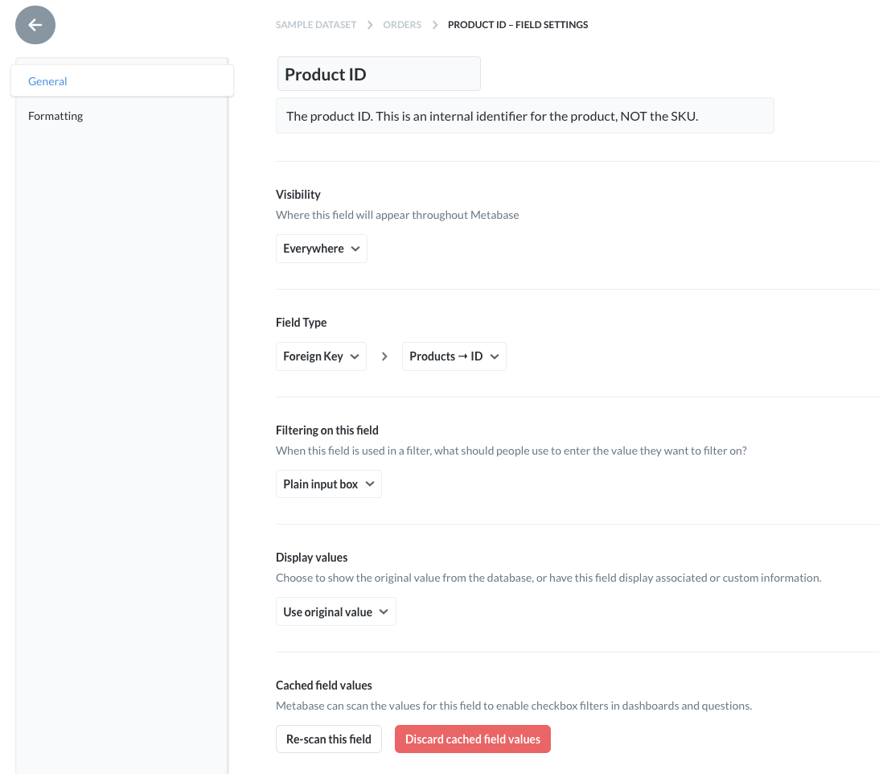
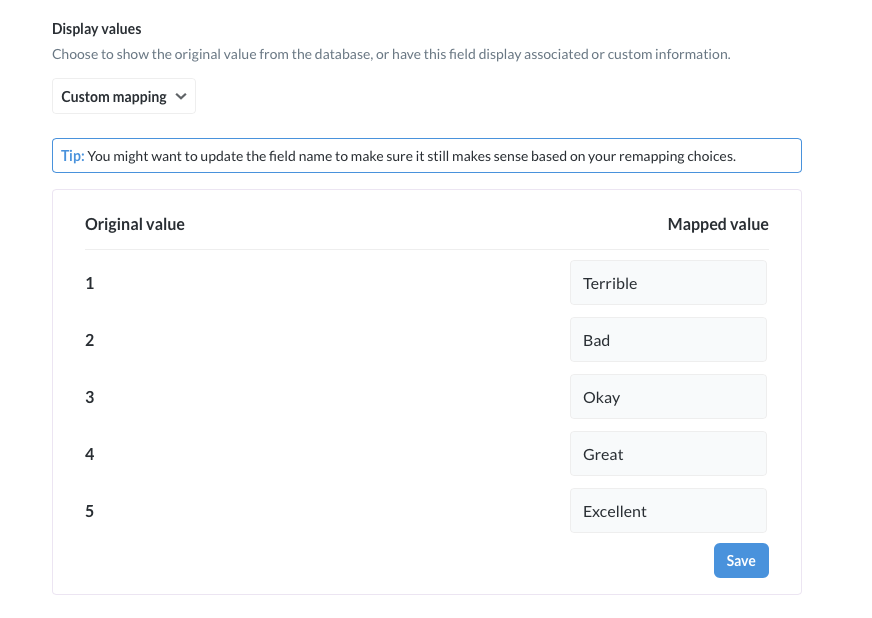
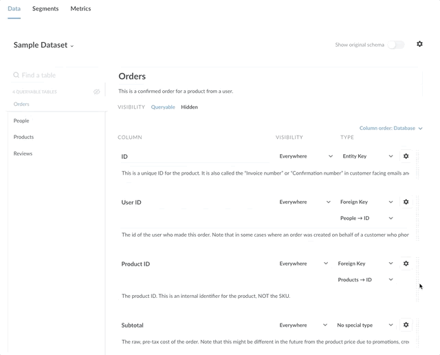

## The Data Model: editing metadata

The **Data Model** section of the **Admin Panel** contains settings to edit metadata for:

- **Tables**
- **Columns**
- **Segments**
- **Metrics**
- **SQL snippets** 

### What is metadata?

<<<<<<< HEAD
Metadata is data about other data. It's information that tells you about the data found in your database. For example, we could label a **column** that looks like just a bunch of numbers with the label "latitude", which would give that **column** additional meaning and context.
=======
Metadata is data about other data. It's information that tells you about the data found in your database. For example, we could label a **column** that looks like just a bunch of numbers with the label “latitude,” which would give that **column** additional meaning and context.
>>>>>>> a89227239dffae7a4a2cf210764dff029e84bd74

Metabase allows you to annotate the data in your database. Annotations can give Metabase a better understanding of what the data actually means, which allows Metabase to make more intelligent decisions when processing and displaying that data.

### Accessing the data model page

Click the settings gear in the top right of Metabase navigation bar, and select **Admin**. Then click on **Data Model** from the top menu.

In the sidebar on the left, you can choose which database to configure. Next, select the table to view and edit its metadata.

### Metadata for tables

For table Metadata, you can:

- Change table **visibility**.
- Change table **name** and **description**.
- View the original **schema**.

#### Table visibility

You can set tables to be **Queryable** or **Hidden**. Setting table visibility can be especially useful if you have a lot of tables in your database but your users will only be interested in a subset of those tables. Table visibility can help keep your Metabase instance tidy by hiding unnecessary tables out of the user interface. 

<<<<<<< HEAD
Visibility settings are distinct from **permissions**. Users can still query hidden tables using the **SQL editor**. See [**permissions**](https://www.metabase.com/docs/latest/administration-guide/05-setting-permissions.html) for controlling access to data.
=======
> Visibility settings are distinct from **permissions**. Users can still query hidden tables using the **SQL editor**. See [**permissions**](https://www.metabase.com/docs/latest/administration-guide/05-setting-permissions.html) for controlling access to data.
>>>>>>> a89227239dffae7a4a2cf210764dff029e84bd74

**Queryable tables** can be selected from the **notebook editor**, and all of the data in the table can be displayed (unless certain columns are excluded — more on that below).

**Hidden tables** can’t be selected from the **notebook editor**, and their data can’t be accessed anywhere in Metabase except in the **Admin Panel** and the **SQL Editor**.

<<<<<<< HEAD

=======

>>>>>>> a89227239dffae7a4a2cf210764dff029e84bd74

#### Table name and description

You can change the **name** and **description** of your tables. Note that the underlying database won’t be affected — changes will only update the name of the table while you’re viewing it within Metabase. Add descriptions to tables to let people know type of data a table contains and how it can be used. Descriptions are displayed in the data model reference panel in Metabase, which you can view by clicking the book icon in the top right of a new or saved question page.

If you ever want to see the original underlying schema for a given table, just click the **Show original schema** toggle in the top-right of the screen.

### Metadata for columns

You can edit metadata for **columns** (or a fields in a document-based database). Metabase automatically attempts to classify your columns and assign them a type. If Metabase misclassified any columns, you can correct those inaccurate classifications here.

For each column, you can edit its: 

- Name
- Description
- Visibility
- Type

#### Column name

To change how the **column** name is displayed, click on the name of the **column**. For example, if your ORM produces table names like “auth.user", you can replace this with “User” to make the **column** more readable. This change only affects how Metabase displays the **column**, the change does not affect the database itself.

#### Description

You can include a human-readable summary of a **column**, its source, and use cases. Any caveats about interpretation can go here as well. Descriptions are particularly useful when **columns** have values that are abbreviated or coded in a particular format.

#### Visibility

By default, users can see every **column** in a table. 

- **Only in Detail Views**. Sets the visibility to display only when viewing a single **column** record. Useful if you have really long data in certain **columns**, like descriptions or biographies. By default, any column with an average length of longer than 50 characters is assigned this setting.

- **Do Not Include**. This column won't be visible or selectable in questions created with the **notebook editor** (the GUI editor). Useful if you have sensitive or irrelevant columns.

> For the **SQL editor**, **Do Not Include** settings only affect visibility in the **data reference** section. Though columns will not be visible in the **data reference** section, users will still be able to query these columns.

#### Types

<<<<<<< HEAD
A **column's** **type** dictates how Metabase displays its data, as well as the column's special functionality, if any. For example, by marking columns in a table as **Latitude** and **Longitude**, Metabase can use the columns to create pin and heat maps. Similarly, marking a column as a **URL** allows users to click on the link to visit the URL.
=======
A **column’s** **type** dictates how Metabase displays its data, as well as the column's special functionality, if any. For example, by marking columns in a table as **Latitude** and **Longitude**, Metabase can use the columns to create pin and heat maps. Similarly, marking a column as a **URL** allows users to click on the link to visit the URL.
>>>>>>> a89227239dffae7a4a2cf210764dff029e84bd74

You can also designate a column as the table's **primary key** or **foreign key**.

**Types** include (organized by category):

- **Special types**
  - **Entity Key**  The field in this table that uniquely identifies each row. Could be a product ID, serial number, etc.
  - **Entity Name**. Different from the entity key, the Entity name represents what each row in the table *is*. For example, in a Users table, the User column might be the entity name.
  - **Foreign Key**. The column in this table that (usually) refers to the primary key of another table in order to connect data from different tables that are related. For example, in a Products table, you might have a Customer ID field that points to a Customers table, where Customer ID is the primary key.
- **Common**
  - Category
  - Comment
  - Description
  - Common
  - Number
  - Title
  - Common
- **Location**
  - City
  - Country
  - Longitude
  - State
  - Zip Code
- **Financial**
  - Discount 
  - Gross margin
  - Income
  - Price
- **Numeric**
  - Quantity
  - Score
  - Share
- **Profile**
  - Birthday
  - Company
  - Email
  - Owner
  - Subscription
  - User
- **Date and Time**
  - Cancelation date
  - Cancelation time
  - Cancelation timestamp
  - Creation date
  - Creation time
  - Creation timestamp
  - Deletion timestamp
  - Join date
  - Join time
  - Join timestamp
  - UNIX Timestamp (Milliseconds)
  - UNIX Timestamp (Seconds)
- **Categorical**
  - Enum
  - Product
  - Source
- **URLs**
  - Avatar Image URL
  - Image URL
  - URL
- **Other**
  - Field containing JSON

### Remapping column values

One thing that happens commonly in tables is that you'll have a **foreign key column**, like `Product ID`, with a bunch of ID values in it, when what you actually want to see most of the time is the **entity name**, like the `Product Title`. You might also have fields which contain coded values that you'd prefer to show up as translated or readable values in your tables and charts — like changing `0`, `1`, and `2` to `Female`, `Male`, and `Other`.

To remap column values, click on the gear icon to the right of a field's Type dropdown in the Data Model section of the Admin Panel. You'll see a form with these options:

`Visibility` and `Type` are the same as on the main Data Model page, but `Display values` lets you choose to swap out a field's values with something else.

**Foreign key remapping** lets you swap out a foreign key's values with the values of any other field in the connected table. In this example, we're swapping out the `Product ID` field's values with the values in the `Title` field in the Product table:

Another option is **custom remapping**, which is currently only possible for numeric fields. This lets you map every number that occurs in this field to either a different numeric value or even to a text value, like in this example:

### Picking the filter user interface for a column

Metabase will automatically try to pick the best kind of filter interface for each column based on that column's type, and the number of different values in it. Columns with only a few possible choices, like a `Gender` column, will display a dropdown list by default when filtering on them. Columns with more than 100 possible selections will show a search box with autocomplete.

You can manually change the user interface for the filter to:

- drop down list
- search box
- plain input box

### Column order

Metabase will default to the column order native to the database.

You can re-order the way Metabase presents columns in menus and other interfaces (without affecting the database) by clicking on the grab bar to the right of each column, and dragging the column to a new position in the order.

<<<<<<< HEAD

=======

>>>>>>> a89227239dffae7a4a2cf210764dff029e84bd74

---

## Next: creating segments and metrics
Learn how to create canonical definitions of your commonly used [segments and metrics](07-segments-and-metrics.md).
